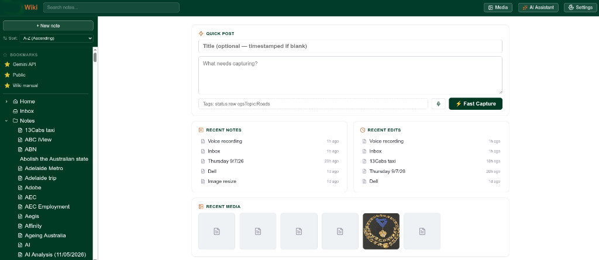
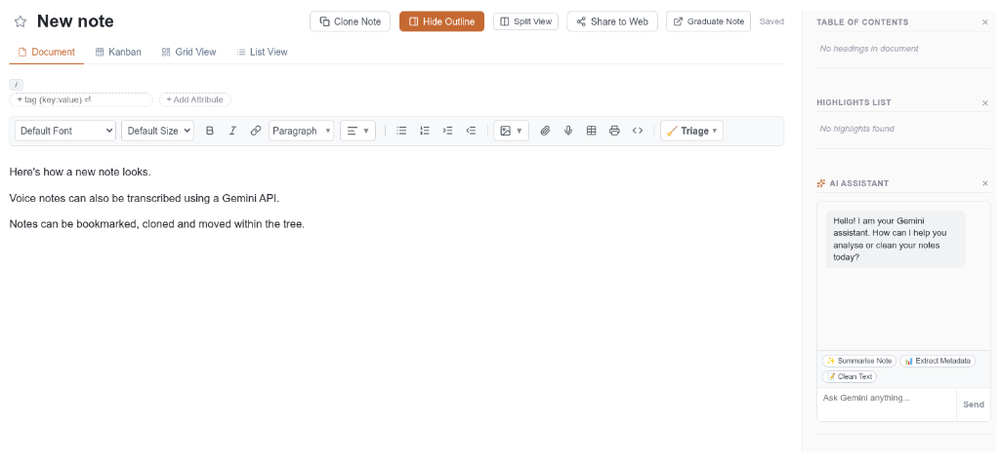
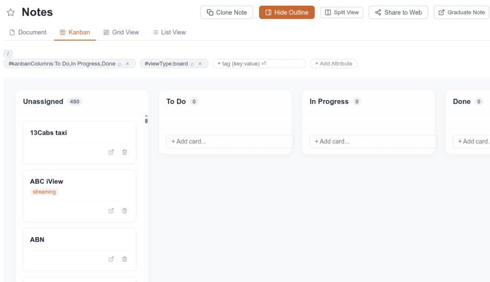

# Personal Wiki

A self-hosted personal wiki inspired by [Trilium Notes](https://github.com/TriliumNext/trilium), built with SvelteKit and Supabase. Offline-first: a full copy of your notes lives in the browser (IndexedDB) and syncs in the background whenever you're online.

## Screenshots

### Dashboard & Quick Capture


### Note Editor & AI Assistant


### Kanban Board View



## Features

- **Offline-first sync** — Dexie (IndexedDB) ⟷ Supabase, works fully offline and catches up automatically
- **Multi-parent note cloning** — a note can live in multiple places in the tree at once, Trilium-style; editing it from any placement updates everywhere
- **Tags & attributes** — `key:value` labels on any note, with a Tag Manager for workspace-wide rename/merge
- **Saved searches** — a note can become a live, self-updating virtual folder (`#topic:Travel #status:planning`)
- **Kanban / Grid / List views** — switch how any note's children are displayed
- **Web clipper browser extension** — clip pages, selections, or screenshots (including full-page and area-select) straight into your Inbox
- **Voice capture** — record a note, get an AI transcript, keep the audio attached
- **Media Library** — every uploaded file in one searchable, taggable place
- **Public sharing** — expose a single note via a public link without exposing the rest of the wiki
- **Trash with recovery** — deleted notes are recoverable for 30 days, then purged automatically
- **MFA-only access** — every read and write requires an MFA-verified (aal2) session; there is no path into your data without it

## Stack

- **SvelteKit** (Svelte 5, TypeScript) with `@sveltejs/adapter-vercel`
- **Supabase** — Postgres storage, auth, and file storage. Every table is protected by Row-Level Security requiring an MFA-verified session (aal2) for all reads and writes
- **Dexie.js** — the offline IndexedDB cache and sync queue (`src/lib/db.ts`, `src/lib/sync.ts`)
- **Tiptap** — the rich-text note editor

## Data model

- `notes` — `id`, `title`, `content`, `is_shared`, `created_at`, `updated_at`
- `branches` — one row per placement of a note in the tree (`note_id`, `parent_id`); a note with multiple branch rows is a clone
- `attributes` — `key:value` labels/relations on a note (tags, saved-search queries, Kanban status, etc.)
- `attachments` — metadata (description, alt text) for files in Supabase Storage

## Getting started

### 1. Create a Supabase project

Create a project at [supabase.com](https://supabase.com). Under **Settings → API**, copy the **Project URL**, the **anon public key**, and the **service_role key** (server-only — never expose this one client-side).

### 2. Run the database migrations

In the Supabase **SQL Editor**, run each file in `supabase/migrations/` **in numeric order**, 0001 through 0009 — **except 0005 and 0006**, which are kept only for history and say so at the top of the file (`SUPERSEDED — do not run`): an early approach to storage permissions that a later migration replaced. Skip straight from 0004 to 0007.

### 3. File storage

Migration 0004 creates the public `clips` storage bucket used for images, attachments, and clipper screenshots. No manual storage policies are needed — uploads go through short-lived signed URLs issued by a server route that verifies your MFA session first (`/api/upload-url`).

### 4. Environment variables

```sh
cp .env.example .env
```

Fill in the Supabase values from step 1, plus:

- `CLIPPER_API_TOKEN` — a random secret for the browser extension (`openssl rand -hex 32`)
- `CRON_SECRET` — a random secret authorizing the weekly maintenance job (see step 7)

Set the same variables in your Vercel project's environment variables for deploy.

### 5. Sign up and enrol MFA

Run `npm install && npm run dev`, create an account through the app's own sign-up, and follow the on-screen prompt to enrol a TOTP authenticator — this happens automatically on first login (Supabase Auth supports TOTP out of the box, nothing extra to configure).

### 6. Deploy to Vercel

Import the repo into Vercel, set the environment variables from step 4, and deploy. `vercel.json` already declares the adapter and the weekly cron (next step).

### 7. Weekly maintenance cron

`vercel.json` schedules a weekly job (Sundays at 03:00 UTC) hitting `/api/cron/purge-trash`, which permanently removes notes that have sat in Trash past the 30-day recovery window. The client already does this purge when the app is opened, but a wiki nobody's visited in a month needs the server-side sweep too.

Set `CRON_SECRET` in Vercel's environment variables (same value as your `.env`) — Vercel automatically sends it as a bearer token when it triggers the cron, which is what the route checks. To change the schedule or point a cron at a different route, edit the `crons` array in `vercel.json` (standard 5-field cron syntax).

### 8. Web clipper extension (optional)

Load `clipper-extension/` as an unpacked extension in Chrome or Edge, then set your deployed URL and `CLIPPER_API_TOKEN` on its options page.

## Development

```sh
npm install
npm run dev     # local dev server
npm run check   # type-check
npm run build   # production build
```

## Acknowledgments

Built collaboratively with **[Claude](https://claude.com)** (Anthropic) and **[Google Antigravity](https://deepmind.google)** as AI pair-programming agents across the majority of this codebase — architecture, features, and code review alike.
